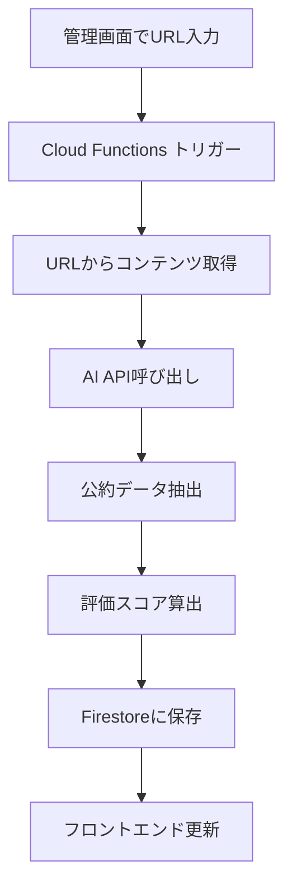

# 政治家評価プラットフォーム - 機能要件書 & 開発ドキュメント

## 1. プロジェクト概要

### 1.1 目的
若い世代の政治への関心を高めるため、候補者の公約を客観的に評価・分析し、分かりやすく可視化するWebアプリケーションを開発する。

### 1.2 技術スタック
- **フロントエンド**: React 18 + TypeScript + Tailwind CSS
- **バックエンド**: Firebase Cloud Functions (Node.js 18)
- **データベース**: Firestore
- **ホスティング**: Firebase Hosting
- **AI/ML**: Gemini 2.5 Pro / Claude 4.0 Opus / Perplexity API
- **認証**: Firebase Authentication
- **ストレージ**: Firebase Storage

## 2. 機能要件

### 2.1 コア機能

#### 2.1.1 候補者情報管理
- **候補者プロフィール表示**
  - 基本情報（氏名、年齢、所属政党、現職/新人）
  - キャッチフレーズ/スローガン
  - これまでの実績リスト
  - 顔写真（Firebase Storage）

#### 2.1.2 政策評価システム
- **多次元評価**
  - 技術的実現性（40%）
  - 政治的実現性（35%）
  - 財政的実現性（25%）
  - 実施期間評価
- **詳細レポート機能**
  - 各評価軸につき500文字程度の分析レポート
  - 参考資料リスト
  - 検索キーワード提供
- **影響度シミュレーション**
  - 経済効果（月額換算）
  - 実現時期予測
  - 恩恵の種類（直接/間接）

#### 2.1.3 比較機能
- 最大3名までの候補者比較
- 政策カテゴリ別比較（レーダーチャート）
- 実現可能性スコアの並列表示

#### 2.1.4 コメント・議論機能
- リアルタイムコメント投稿
- いいね機能
- 不適切コメントの自動フィルタリング（Cloud Functions）
- スレッド形式のディスカッション

### 2.2 URL分析機能（Cloud Functions）

#### 2.2.1 機能概要
管理者がPDFやWebページのURLを入力すると、AIが自動で公約を分析し、データベースに登録する。

#### 2.2.2 処理フロー


#### 2.2.3 実装詳細
```typescript
// Cloud Functions実装例
export const analyzeManifestoUrl = functions
  .runWith({ memory: '2GB', timeoutSeconds: 540 })
  .https.onCall(async (data, context) => {
    // 認証チェック
    if (!context.auth || !context.auth.token.admin) {
      throw new functions.https.HttpsError(
        'permission-denied',
        'Admin access required'
      );
    }

    const { url, prefecture, electionType, candidateName } = data;

    // URLコンテンツ取得
    const content = await fetchUrlContent(url);
    
    // AI分析
    const analysis = await analyzeWithAI(content, {
      model: 'gemini-2.5-pro',
      candidateName,
      electionType
    });
    
    // Firestoreに保存
    await saveToFirestore(analysis, prefecture, electionType);
    
    return { success: true, analysisId: analysis.id };
  });
```

### 2.3 データ構造

#### 2.3.1 Firestore コレクション設計

```typescript
// candidates/{candidateId}
interface Candidate {
  id: string;
  name: string;
  age: number;
  party: string;
  status: 'incumbent' | 'newcomer' | 'former';
  prefecture: string;
  electionType: string;
  electionDate: Timestamp;
  slogan: string;
  photoUrl?: string;
  achievements: string[];
  createdAt: Timestamp;
  updatedAt: Timestamp;
}

// candidates/{candidateId}/policies/{policyId}
interface Policy {
  id: string;
  title: string;
  category: string;
  description: string;
  feasibilityScore: number;
  impact: 'high' | 'medium' | 'low';
  detailedEvaluation: {
    technical: EvaluationDetail;
    political: EvaluationDetail;
    financial: EvaluationDetail;
    timeline: EvaluationDetail;
  };
  sourceUrl?: string;
  analyzedBy: 'gemini' | 'claude' | 'perplexity' | 'manual';
  analyzedAt: Timestamp;
}

interface EvaluationDetail {
  score: number;
  summary: string;
  report: string;
  references: string[];
  searchKeywords: string[];
}

// comments/{commentId}
interface Comment {
  id: string;
  candidateId: string;
  policyId?: string;
  userId: string;
  userName: string;
  text: string;
  likes: number;
  likedBy: string[];
  createdAt: Timestamp;
  moderationScore?: number;
  status: 'active' | 'hidden' | 'deleted';
}
```

## 3. 非機能要件

### 3.1 パフォーマンス
- 初期ロード時間: 3秒以内
- API レスポンス: 1秒以内
- リアルタイム更新: 100ms以内

### 3.2 セキュリティ
- Firebase Security Rules による適切なアクセス制御
- XSS対策: DOMPurify によるサニタイゼーション
- CSRF対策: Firebase Authentication のトークン検証
- レート制限: Cloud Functions での実装

### 3.3 スケーラビリティ
- 同時接続ユーザー: 10,000人対応
- データ量: 全国1,000候補者対応
- Cloud Functions の自動スケーリング活用

## 4. 開発環境セットアップ

### 4.1 必要なツール
```bash
# Node.js 18.x LTS
# npm 9.x or yarn 1.22.x
# Firebase CLI
npm install -g firebase-tools

# プロジェクト初期化
firebase init
# Functions, Firestore, Hosting, Storage を選択
```

### 4.2 環境変数設定
```bash
# .env.local (フロントエンド用)
REACT_APP_FIREBASE_API_KEY=your-api-key
REACT_APP_FIREBASE_AUTH_DOMAIN=your-auth-domain
REACT_APP_FIREBASE_PROJECT_ID=your-project-id
REACT_APP_FIREBASE_STORAGE_BUCKET=your-storage-bucket
REACT_APP_FIREBASE_MESSAGING_SENDER_ID=your-sender-id
REACT_APP_FIREBASE_APP_ID=your-app-id

# functions/.env (Cloud Functions用)
GEMINI_API_KEY=your-gemini-api-key
CLAUDE_API_KEY=your-claude-api-key
PERPLEXITY_API_KEY=your-perplexity-api-key
```

### 4.3 プロジェクト構造
```
project-root/
├── src/                    # React アプリケーション
│   ├── components/         # UIコンポーネント
│   ├── features/          # 機能別モジュール
│   │   ├── candidates/
│   │   ├── policies/
│   │   ├── comments/
│   │   └── analysis/
│   ├── hooks/             # カスタムフック
│   ├── services/          # Firebase サービス層
│   └── utils/             # ユーティリティ関数
├── functions/             # Cloud Functions
│   ├── src/
│   │   ├── analyzers/     # AI分析モジュール
│   │   ├── scrapers/      # URL コンテンツ取得
│   │   └── validators/    # データ検証
│   └── lib/               # ビルド済みファイル
├── firestore.rules        # Firestore セキュリティルール
├── storage.rules          # Storage セキュリティルール
└── firebase.json          # Firebase 設定
```

## 5. デプロイメント

### 5.1 ビルドコマンド
```bash
# フロントエンドビルド
npm run build

# Functions デプロイ
cd functions && npm run deploy

# 全体デプロイ
firebase deploy
```

### 5.2 CI/CD 設定 (GitHub Actions)
```yaml
name: Deploy to Firebase

on:
  push:
    branches: [ main ]

jobs:
  deploy:
    runs-on: ubuntu-latest
    steps:
    - uses: actions/checkout@v3
    - uses: actions/setup-node@v3
      with:
        node-version: '18'
    
    - name: Install dependencies
      run: |
        npm ci
        cd functions && npm ci
    
    - name: Build
      run: npm run build
    
    - name: Deploy to Firebase
      uses: w9jds/firebase-action@master
      with:
        args: deploy
      env:
        FIREBASE_TOKEN: ${{ secrets.FIREBASE_TOKEN }}
```

## 6. API エンドポイント仕様

### 6.1 Cloud Functions エンドポイント

#### 分析API
```typescript
// POST /analyzeManifesto
interface AnalyzeManifestoRequest {
  url: string;
  candidateName: string;
  prefecture: string;
  electionType: string;
  electionDate: string;
}

interface AnalyzeManifestoResponse {
  success: boolean;
  candidateId: string;
  policies: Policy[];
  analysisMetadata: {
    aiModel: string;
    analyzedAt: string;
    processingTime: number;
  };
}
```

#### モデレーションAPI
```typescript
// POST /moderateComment
interface ModerateCommentRequest {
  text: string;
  userId: string;
}

interface ModerateCommentResponse {
  allowed: boolean;
  score: number;
  reasons?: string[];
}
```

## 7. モニタリング・運用

### 7.1 監視項目
- Firebase Performance Monitoring
- Cloud Functions エラー率
- Firestore 読み取り/書き込み数
- ユーザーエンゲージメント指標

### 7.2 アラート設定
- エラー率 > 1%
- レスポンスタイム > 3秒
- 月間読み取り数 > 割り当ての80%

## 8. 今後の拡張計画

### Phase 1 (MVP) - 2ヶ月
- 山形県参議院選挙対応
- 基本的な評価・比較機能
- 管理者による手動データ入力

### Phase 2 (全国展開) - 4ヶ月
- 47都道府県対応
- AI自動分析機能
- ユーザー認証・プロファイル

### Phase 3 (高度な分析) - 6ヶ月
- 過去の公約達成率トラッキング
- 政治家の投票行動分析
- 予測モデルの実装

## 9. 開発チーム構成

- **フロントエンドエンジニア** (2名)
- **バックエンドエンジニア** (1名)
- **AI/MLエンジニア** (1名)
- **UI/UXデザイナー** (1名)
- **プロダクトマネージャー** (1名)

## 10. 参考資料

- [Firebase Documentation](https://firebase.google.com/docs)
- [React + TypeScript Best Practices](https://react-typescript-cheatsheet.netlify.app/)
- [Gemini API Documentation](https://ai.google.dev/docs)
- [Claude API Documentation](https://docs.anthropic.com/claude/reference)
- [Firebase Security Rules Guide](https://firebase.google.com/docs/rules)